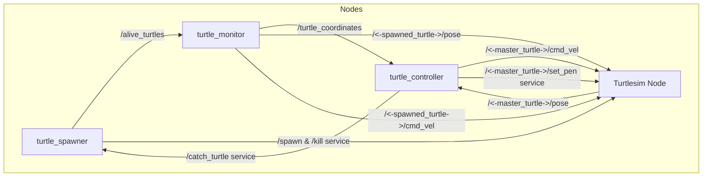

# Turtlesim "Catch Them All" Project

This project expands upon the basic Turtlesim simulation in ROS 2, introducing features for dynamic turtle management and control. The goal is to create a multi-turtle environment where "master" turtles actively catch randomly moving "spawned" turtles.

---

## Project Overview

The project leverages the Turtlesim package as a visualization and simulation tool. It demonstrates key ROS 2 concepts such as nodes, topics, services, and custom interfaces.

The application is structured around several core nodes:
* **`turtlesim_node`**: The standard Turtlesim simulator.
* **`turtle_controller`**: Controls the "master" turtles to chase and catch other turtles.
* **`turtle_spawner`**: Manages the spawning and killing of additional turtles within the simulation window.
* **`turtle_monitor`**: Responsible for controlling the movements of spawned turtles and dynamically managing their communication interfaces.

---

## Architecture

The system's architecture includes the following ROS 2 nodes and communication patterns:

* **`/turtle_spawner`**:
    * **Advertises**: `/spawn` (calls `turtlesim_node`), `/kill` (calls `turtlesim_node`), `/catch_turtle` (service server).
    * **Publishes**: `/alive_turtles` (list of `TurtleArray` messages).
* **`/turtle_monitor` (New)**:
    * **Subscribes**: `/alive_turtles` (from `turtle_spawner`).
    * **Dynamically Creates**: Subscriptions to `/<turtle_name>/pose` and Publishers to `/<turtle_name>/cmd_vel` for spawned turtles.
    * **Publishes**: `/turtle_coordinates` (updated coordinates of spawned turtles for `turtle_controller`).
* **`/turtle_controller`**:
    * **Subscribes**: `/<master_turtle_name>/pose` and `turtle_coordinates` (from `turtle_monitor`).
    * **Publishes**: `/<master_turtle_name>/cmd_vel`.
    * **Calls**: `/catch_turtle` (service client to `turtle_spawner`).
    * **Calls**: `/<master_turtle_name>/set_pen` (service client to `turtlesim_node` for pen color changes).
* **`/turtlesim`**:
    * **Subscribes**: `/<turtle_name>/cmd_vel` (for all active turtles).
    * **Publishes**: `/<turtle_name>/pose` (for all active turtles).
    * **Advertises**: `/spawn`, `/kill`, `/<turtle_name>/set_pen` (service servers).

Below is a visualization of the core communication (illustrating the `turtlesim_node`, `turtle_spawner`, and `turtle_controller` interactions, which now applies to multiple controllers, and the conceptual flow of messages/services):



## Setup and Running

1.  **Clone the repository:**
    ```bash
    git clone https://github.com/Ashwith25/turtle-bot-chaser
    cd turtle-bot-chaser
    ```
2.  **Build the ROS 2 workspace:**
    ```bash
    colcon build
    ```
3.  **Source the setup files:**
    ```bash
    source install/setup.bash
    ```
4.  **Launch the project:**
    (The launch file is located in the `turtle_bringup` package, which will bring up all the necessary nodes including `turtlesim_node`, `turtle_spawner`, `turtle_monitor`, and multiple instances of `turtle_controller`.)
    ```bash
    ros2 launch turtle_bringup turtle_catch_em_all.launch.xml
    ```
---

## Contributing

Feel free to contribute to this project by opening issues or submitting pull requests!
